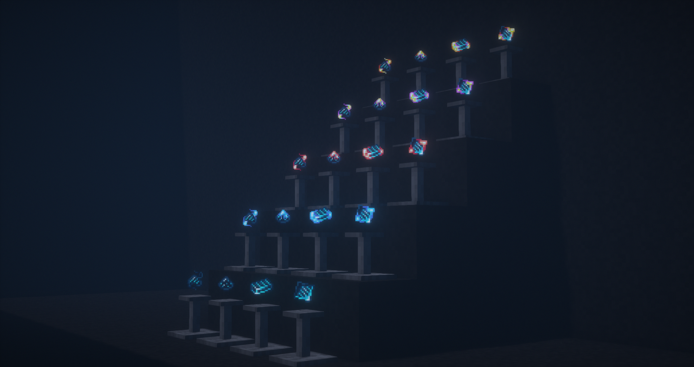

# LoliDragonMight

### Броня и Посох Хаоса

Являются улучшенными версиями своих предшественников.

**Посох Хаоса** способен копать 21х21 блок и наносить более 500 урона за один удар. Он способен содержать в себе 22 ядра для модификации.\
**Броня Хаоса** имеет более лучшую защиту, а также энергоёмкость.

<figure><figcaption>
Броня и Посох Хаоса
</figcaption></figure>

### Спавнер Хаоса и его улучшенная версия

Может вместить в себе до 120 различных душ. Имеются слоты под улучшения, в которые можно положить ядра всех видов(кроме энергетических), а также Яблоко Нотча и Звезду Ада.

<figure><figcaption>
Спавнер Хаоса и Легендарный Спавнер Хаоса
</figcaption></figure>



Данная разновидность предметов является составляющими некоторых крафтов. Другого применения они не имеют. Драконий представляет собой сам драконий, пыль, слиток и пластину. Его можно получить с Драконов соответствующего уровня, подробнее об драконах можно найти [<mark style="color:purple;">**Здесь**</mark>](drakony.md)

<figure><figcaption></figcaption></figure>



Сердца также являются элементами различных крафтов. Как их добыть подробнее  описано  [<mark style="color:purple;">**Здесь**</mark>](drakony.md)<mark style="color:purple;">**.**</mark>&#x20;

<figure><figcaption></figcaption></figure>



### Модули Добычи

Вставляется в специальный слот в Легендарном Спавнере Хаоса, позволяет умножать полученный лут в мобов.

<figure><figcaption>
Модули Добычи
</figcaption></figure>

### Продвинутый Конденсатор Хаоса

Является улучшенной версией своих предшественников, может хранить в себе до 2 млрд энергии.

<figure><figcaption>
Продвинутый кондесатор Хаоса
</figcaption></figure>

### Энергетические беспроводные передатчики EU

Работают по такому же принципу как и передатчики RF энергии, но передают EU энергию.\

<figure><figcaption>
Энергетические беспроводные передатчики EU
</figcaption></figure>


Другие предметы, которые не были описанны выше, являются составляющими крафта и какой-либо функциональной нагрузки не несут, так что не вижу смысла их описывать.

