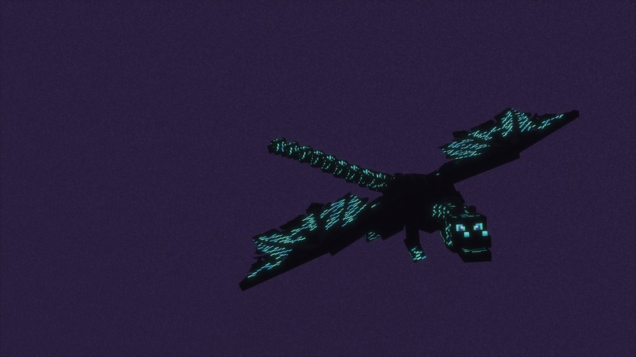
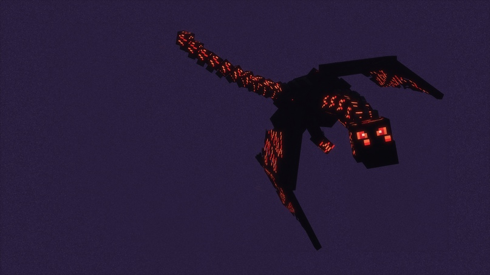

# 🐉 Драконы

### Хранитель Холода

Следующий за Хранителем Хаоса дракон, c которым вам нужно будет сразиться. С него можно выбить Сердце Хранителя Холода.

<figure><figcaption>
Хранитель Холода
</figcaption></figure>

### Хранитель Пламени

Хранитель Пламени идет сразу после Хранителя Холода. Из него можно выбить Сердце Хранителя Пламени.

<figure><figcaption>
Хранитель Пламени
</figcaption></figure>

### Дракон Бесконечности

Бывший Инфинити Дракон, с него выпадает Сердце Дракона Бесконечности

<figure><figcaption>
Дракон Бесконечности
</figcaption></figure>

### Демонический Дракон Бесконечности

Самый мощный дракон в игре! С него можно выбить Сердце Демонического Дракона Бесконечности.

<figure><figcaption>
Демонический Дракон Бесконечности
</figcaption></figure>


* Если появились молнии, значит призыв дракона успешно начался(в случаи отсутствии молний, включите анимации в настройках игры, если они так и не появились, значит вы ошиблись в конструкции)
* Не <mark style="color:red;">**НАЖИМАТЬ**</mark> более одного раза на камень воскрешения, иначе призыв не произойдет
* Призывается только на <mark style="color:red;">основном</mark> острове Энда

