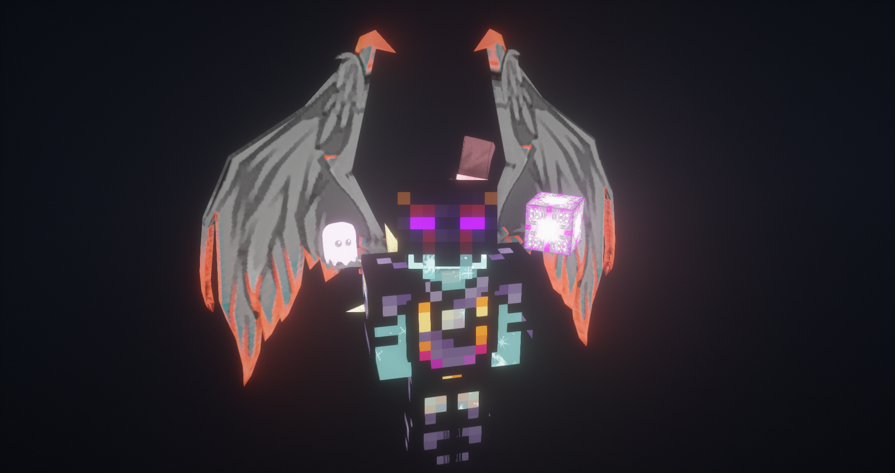
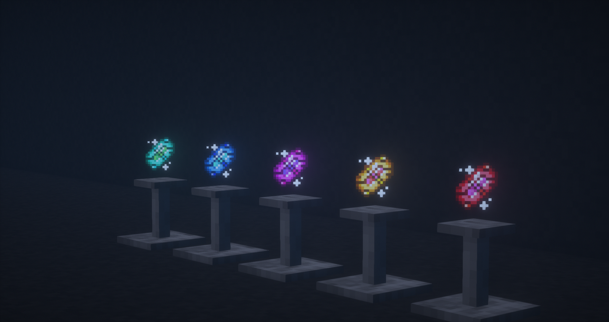
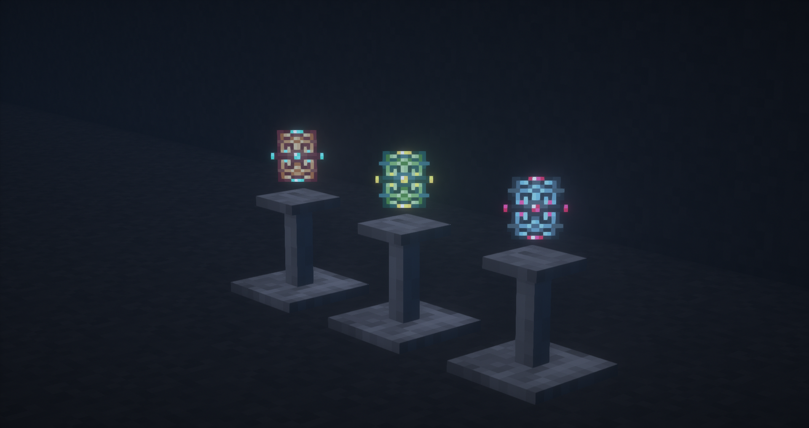
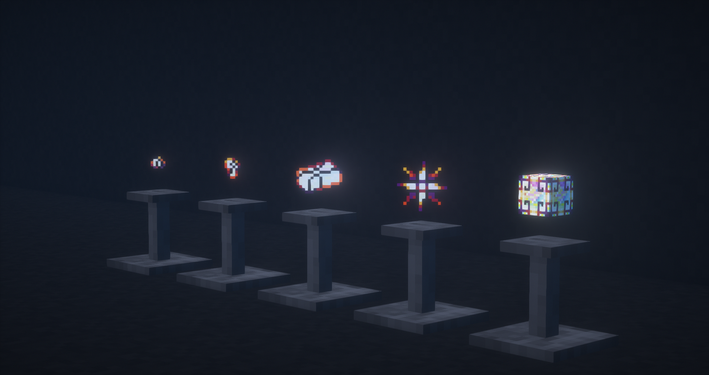

# LoliEnergyRelics

Призван дополнить технические моды и сделать PvP-составляющую сервера более интересной.

<figure><figcaption>
Предметы из мода LoliEnergyRelics
</figcaption></figure>

### Демоническая броня бесконечности

Усиленный аналог обычной _брони бесконечности_. Если владелец надел эту броню, нанести ему урон можно лишь с помощью _демонического меча бесконечности_.\

<figure><figcaption>
Демоническая броня бесконечности
</figcaption></figure>

### Демонический меч бесконечности

Усиленный аналог _обычного меча бесконечности_. Способен убить противника в обычной _броне бесконечности_ за один удар. Также это единственный предмет, способный пробить _демоническую броню бесконечности_. При ударе снимает все эффекты с противника, а затем накладывает иссушение 50 уровня. Скорость ударов выше, чем у обычного _меча бесконечности_. Также по умолчанию имеет зачарование добычи 20 уровня.\

<figure><figcaption>
Демонический меч бесконечности
</figcaption></figure>

### **Усилитель урона (1-5 уровень)**

Усиливает атаки владельца, расходуя энергию. Количество энергии за одно использование зависит от уровня усилителя.

<figure><figcaption>
Усилитель урона (1-5 уровень)
</figcaption></figure>

### **Усилитель защиты (1-5 уровень)**

Улучшает защиту владельца, расходуя энергию, сокращая входящий урон. Эффективность зависит от уровня усилителя.

<figure><figcaption>
Усилитель защиты (1-5 уровень)
</figcaption></figure>

### **Усилитель регенерации (1-5 уровень)**

Пассивно восстанавливает здоровье владельца, расходуя энергию. Эффективность зависит от уровня усилителя.

<figure><figcaption>
Усилитель регенерации (1-5 уровень)
</figcaption></figure>

### **Инвентарный EU-генератор (1-5 уровень)**

Наполняет EU-энергией предметы в инвентаре игрока, в том числе и надетую броню. Имеет 5 уровней

<figure><figcaption>
Инвентарный EU-генератор (1-5 уровень)
</figcaption></figure>

###

### Нано-усилитель и Квантовый усилитель

В зависимости от надетой брони накладывает эффекты Силы, Регенерации и Сопротивления. Нано-броня дает 2 уровень эффектов, а квантовая — 4 уровень. Достаточно надеть только часть сета.

<figure><figcaption>
Усилитель Нано-Брони
</figcaption></figure>

 

<figure><figcaption>
Усилитель Квант-Брони
</figcaption></figure>

### Щит дракона

Позволяет избежать урона с помощью RF-энергии. Есть 3 уровня щита: на 100 000 000 RF, на 500 000 000 RF и на 1 000 000 000 RF. Щиты активируются по очереди, от большего уровня к меньшему. Если требуемое количество энергии для защиты от удара превышает заряд щита, урон не будет заблокирован.

Чтобы обойти щиты игроков, у которых полный инвентарь флаксовых конденсаторов, достаточно будет наносить больше 8333 урона за удар. Так щит просто не сработает.

<figure><figcaption>
Щиты дракона (3 уровня)
</figcaption></figure>

### Предметы, использующиеся в крафтах

Серия демонически-бесконечных предметов, используются только в крафтах\

<figure><figcaption></figcaption></figure>
