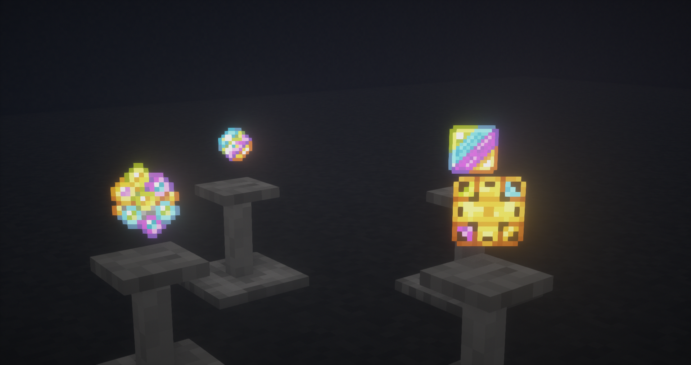

# LoliForestry

#### Небольшой аддон_,_ дополняющий мод _Forestry_. Пока что в нем всего один механизм.

### Совершенная пасека

<figure><figcaption>
Совершенная пасека
</figcaption></figure>

_Совершенная пасека_ может хранить в себе 4 типа аспектов _Thaumcraft_ , за счет которых она будет улучшать свои характеристики.

При наличии аспекта _**Meto** _ будет **увеличиваться** количество основной продукции, а за счет _**Fames** _ — **дополнительной**. За счет _**Machina** _ будет **увеличиваться** скорость работы пчел, а за счет _**Vitium** _ — **усиливаться** эффект _Empowering_. Пасека может хранить в себе только 3 вида аспектов!

Для своей работы _совершенная пасека_ требует RF или EU. Однако в ней есть и буфер маны: когда он заполнен, пчелы будут игнорировать все условия (биом, погоду, влажность, температуру и т. д.). Подать ману можно как _распространителями маны_, так и _искрами_.


Также в _совершенной пасеке_ есть 3 слота для улучшений. В них можно положить _печать Азанора_, _улучшение Асгард,_ любые кольца, любые EU- и RF-хранилища.


<figure><figcaption>
Предметы из LoliForestry
</figcaption></figure>

Данные предметы являются составляющими некоторых _крафтов_.
