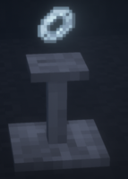
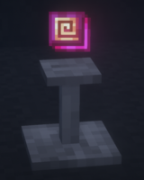
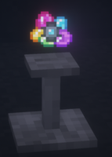
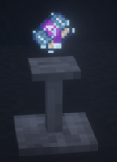

# LoliEnergyRelics

Призван дополнить технические моды и сделать PvP-составляющую сервера более интересной.

<figure><figcaption>
Предметы из мода LoliEnergyRelics
</figcaption></figure>

### Демоническая броня бесконечности

Усиленный аналог обычной _брони бесконечности_. Если владелец надел эту броню, нанести ему урон можно лишь с помощью _демонического меча бесконечности_.\

<figure><figcaption>
Демоническая броня бесконечности
</figcaption></figure>

### Демонический меч бесконечности

Усиленный аналог _обычного меча бесконечности_. Способен убить противника в обычной _броне бесконечности_ за один удар. Также это единственный предмет, способный пробить _демоническую броню бесконечности_. При ударе снимает все эффекты с противника, а затем накладывает иссушение 50 уровня. Скорость ударов выше, чем у обычного _меча бесконечности_. Также по умолчанию имеет зачарование добычи 20 уровня.\

<figure><figcaption>
Демонический меч бесконечности
</figcaption></figure>

### **Усилитель урона (1-5 уровень)**

Усиливает атаки владельца, расходуя энергию. Количество энергии за одно использование зависит от уровня усилителя.

<figure><figcaption>
Усилитель урона (1-5 уровень)
</figcaption></figure>

### **Усилитель защиты (1-5 уровень)**

Улучшает защиту владельца, расходуя энергию, сокращая входящий урон. Эффективность зависит от уровня усилителя.

<figure><figcaption>
Усилитель защиты (1-5 уровень)
</figcaption></figure>

### **Усилитель регенерации (1-5 уровень)**

Пассивно восстанавливает здоровье владельца, расходуя энергию. Эффективность зависит от уровня усилителя.

<figure><figcaption>
Усилитель регенерации (1-5 уровень)
</figcaption></figure>

### **Инвентарный EU-генератор (1-5 уровень)**

Наполняет EU-энергией предметы в инвентаре игрока, в том числе и надетую броню. Имеет 5 уровней

<figure><figcaption>
Инвентарный EU-генератор (1-5 уровень)
</figcaption></figure>

### Остальные Реликвии

<mark style="color:blue;">**Электролизированное ядро хаоса**</mark>**                                                                                                       **                                                                                                 Предотвращает смерть владельца, полностью восстанавливая ХП. Потребляет 333 333 333 EU за использование. Хранит в себе 999 999 999 EU. Можно использовать сразу несколько ядер. Скорость зарядки ограничена 3 000 000 EU в тик.

<mark style="color:blue;">**Ядро Кражи силы**</mark>\
При ударе обменивает здоровье цели и владельца, если здоровье владельца меньше здоровья цели. Если здоровье цели больше максимального здоровья владельца, владелец просто восстановит здоровье до максимально возможно уровня.

<mark style="color:blue;">**Энергетическое зеркало**</mark>\
С шансом 50% отражает получаемый удар и возвращает его атакующему, расходуя энергию. Не стакается.

<mark style="color:blue;">**Конвертер урона**</mark>\
При использовании изменяет тип входящего и исходящего урона на истинный. При конвертации и входящий, и исходящий урон увеличиваются в несколько раз. Позволяет легко пробивать броню из _IC2_ и _GSuite_.

<mark style="color:blue;">**Аннулятор баффов**</mark>\
При ударе с владельца и с цели снимаются все эффекты. Необязательно бить самим предметом, можно просто держать его в инвентаре во время атаки.

<mark style="color:blue;">**Ускоритель копания**</mark>\
Увеличивает скорость копания, расходуя энергию.

<mark style="color:blue;">**Генератор рандомных эффектов**</mark>\
Генерирует рандомные эффекты.

<mark style="color:blue;">**Парадокс**</mark>\
Наносит случайное количество урона в указанном диапазоне. При каждом ударе вы также получаете урон, равный разнице нанесенного и максимального урона.

<mark style="color:blue;">**Вор RF**</mark>\
При ударе по противнику ворует из всех RF-предметов энергию. Количество зависит от урона атакующего. Воры RF не стакаются.

<mark style="color:blue;">**Том беззакония**</mark>\
Уменьшает любой наносимый и получаемый урон в 10 раз. В отличие от оригинального предмета из _LoliChaosMagic_, имеет под собой основу на EU-энергии. Для соблюдения баланса возможность задействовать более одного _тома беззакония_ за раз отключена.

<mark style="color:blue;">**Усилитель RF**</mark>\
Накладывает баффы сопротивления, регенерации, силы, поглощения и скорости 4 уровня (если на сервере есть мод _Botania_, накладывает еще и эффект _soul cross_) , расходуя RF-энергию.


Если вы держите в руках _инфинити-меч_, эффект силы будет отключен.


<mark style="color:blue;">**Аннигилятор снарядов**</mark>\
Создает бесконечный щит из _Draconic Evolution_ вокруг игрока, защищающий от снарядов и взрывов.

<mark style="color:blue;">**Ускоритель частиц**</mark>\
Значительно ускоряет движение игрока в воздухе и увеличивает его прыжок, потребляя RF. Ускорители не стакаются.

<mark style="color:blue;">**Аннулятор невидимок**</mark>\
Обнуляет эффект невидимости у всех существ в радиусе 16 блоков.

<mark style="color:blue;">**Том безграничной мудрости**</mark>\
Может хранить любое количество опыта.

В режиме Поглощения поглощает весь ваш опыт, пока находится в инвентаре.

В режиме Извлечения передает весь опыт обратно.

Для переключения режима нажмите <mark style="color:red;">**Shift + ПКМ.**</mark>

<mark style="color:blue;">**Катализатор берсерка**</mark>\
В зависимости от количества вашего здоровья, вам будет добавляться урон. Чем меньше у вас здоровья, тем больше урона вы сможете нанести.

Например, у вас 30% от максимального здоровья. Это значит, что ваш урон и затраты энергии увеличатся на 70% (100%-30%).

<mark style="color:blue;">**Колчан инфинити лучника**</mark>\
Урон от снарядов и стрел увеличен в 50 раз. Также это распространяется на некоторые набалдашники.

<mark style="color:blue;">**Хранитель силы убийцы**</mark>\
Работает при нанесении урона оружием из Draconic Evolution. Если у врага больше 85% здоровья, вы нанесете гарантированные 50% критического урона. Если вы атакуете моба, он умрет с 1 удара.

<mark style="color:blue;">**Конденсатор Хирайшин**</mark>\
С шансом 10% при нанесении повреждений владельца телепортирует за спину к атакованному существу. Можно использовать дальнюю атаку.

<mark style="color:blue;">**Обратный конденсатор Хирайшин**</mark>\
С шансом 5% может развернуть взгляд противника. Если носить с собой Энергетическое зеркало, при отражении противник может повернуть сам себя.

<mark style="color:blue;">**Драконий аннигилятор**</mark>\
Усиливает урон у всех драконивых оружий в 50 раз, в том числе у разряженных.

<mark style="color:blue;">**Скоростной блиц-генератор**</mark>\
Накладывает пассивные эффекты Скорости, Ускорения и Регенерации 4 уровня. С шансом 10% мгновенно контратакует, перемещаясь к противнику за спину, при этом нанесенный владельцу урон отменяется.

<mark style="color:blue;">**Катализатор времени**</mark>                                                                                                                                           Ухудшает проходимость ударов по его носителю.

<figure><figcaption>
Усилитель RF
</figcaption></figure>

 

<figure><figcaption>
Вор RF
</figcaption></figure>

 

<figure><figcaption>
Ускоритель Копания
</figcaption></figure>

 

<figure><figcaption>
Ускоритель Частиц
</figcaption></figure>

 

<figure><figcaption>
Хранитель Силы Убийцы
</figcaption></figure>

<figure><figcaption>
Энергетическое Зеркало
</figcaption></figure>

 

<figure><figcaption>
Ядро Кражи Силы
</figcaption></figure>

 

<figure><figcaption>
Аннигилятор Снарядов
</figcaption></figure>

 

<figure><figcaption>
Аннулятор Баффов
</figcaption></figure>

 

<figure><figcaption>
Аннулятор Невидимок
</figcaption></figure>

<figure><figcaption>
Генератор рандомных  эффектов
</figcaption></figure>

 

<figure><figcaption>
Драконий Аннигилятор
</figcaption></figure>

 

<figure><figcaption>
Катализатор Берсерка
</figcaption></figure>

 

<figure><figcaption>
Колчан Инфинити Лучника
</figcaption></figure>

 

<figure><figcaption>
Конвертер Урона
</figcaption></figure>

<figure><figcaption>
Конденсатор Хирайшин
</figcaption></figure>

 

<figure><figcaption>
Обратный Конденсатор  Хирайшин
</figcaption></figure>

 

<figure><figcaption>
Парадокс
</figcaption></figure>

 

<figure><figcaption>
Скоростной  Блиц-Генератор
</figcaption></figure>

 

<figure><figcaption>
Том Беззакония
</figcaption></figure>

<figure><figcaption>
Том Мудрости
</figcaption></figure>

 

<figure><figcaption>
Ядро Хаоса
</figcaption></figure>

### Нано-усилитель и Квантовый усилитель

В зависимости от надетой брони накладывает эффекты Силы, Регенерации и Сопротивления. Нано-броня дает 2 уровень эффектов, а квантовая — 4 уровень. Достаточно надеть только часть сета.

<figure><figcaption>
Усилитель Нано-Брони
</figcaption></figure>

 

<figure><figcaption>
Усилитель Квант-Брони
</figcaption></figure>

### Щит дракона

Позволяет избежать урона с помощью RF-энергии. Есть 3 уровня щита: на 100 000 000 RF, на 500 000 000 RF и на 1 000 000 000 RF. Щиты активируются по очереди, от большего уровня к меньшему. Если требуемое количество энергии для защиты от удара превышает заряд щита, урон не будет заблокирован.

Чтобы обойти щиты игроков, у которых полный инвентарь флаксовых конденсаторов, достаточно будет наносить больше 8333 урона за удар. Так щит просто не сработает.

<figure><figcaption>
Щиты дракона (3 уровня)
</figcaption></figure>

### Предметы, использующиеся в крафтах

Серия демонически-бесконечных предметов, используются только в крафтах\

<figure><figcaption></figcaption></figure>
